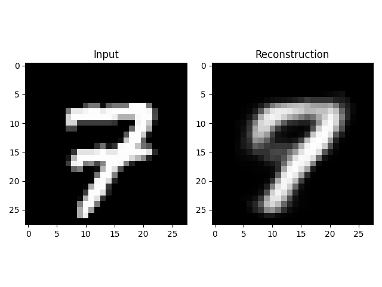
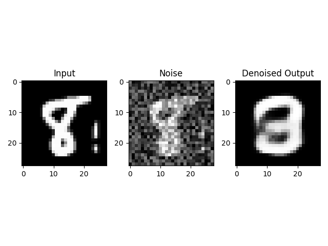
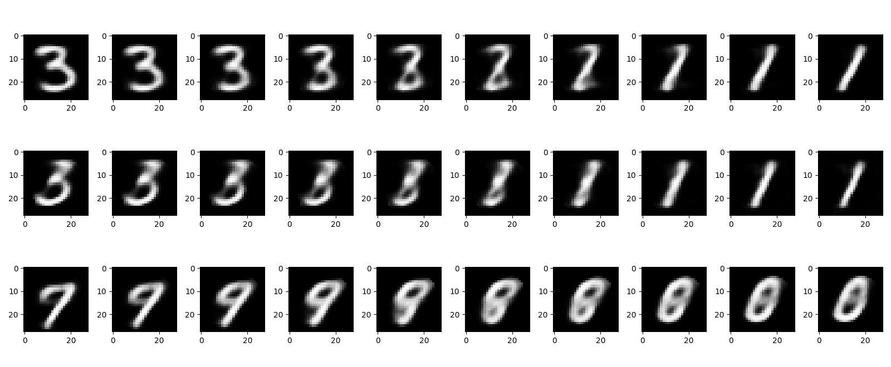

# MLP for MNIST
A PyTorch implementation of a Multi-Layer Perceptron (MLP) Autoencoder designed to perform dimensionality reduction, image reconstruction, and denoising on the MNIST dataset.

## 📌 Project Overview
The goal of this project is to explore the capabilities of autoencoders by implementing a 4-layer neural network. The model compresses 28x28 grayscale images into a small "bottleneck" latent representation and then reconstructs them.

Key features include:
- **Compression**: Reduces input dimensionality (784 features) to a compact bottleneck (e.g., 8 features).
- **Reconstruction**: Accurately rebuilds digit images from the compressed latent space.
- **Denoising**: Removes noise from corrupted images.
- **Latent Interpolation**: Visualizes the "morphing" between two digits by interpolating their bottleneck vectors.

## 🧠 Model Architecture

The model is defined in ```model.py``` as ```autoencoderMLP4Layer```. It consists of an Encoder and a Decoder:

```
| Stage       | Layer Type | Input Size     | Output Size    | Activation |
| :---------- | :--------- | :------------- | :------------- | :--------- |
| **Encoder** | Linear     | 784 (28x28)    | 392            | ReLU       |
| **Encoder** | Linear     | 392            | N (Bottleneck) | ReLU       |
| **Decoder** | Linear     | N (Bottleneck) | 392            | ReLU       |
| **Decoder** | Linear     | 392            | 784 (28x28)    | Sigmoid    |
```

- **Input**: Flattened MNIST images (1x784).
- **Optimization**: Adam Optimizer with learning rate scheduling (ReduceLROnPlateau).
- **Loss Function**: Mean Squared Error (MSE).

## 📂 Repository Structure

```plaintext
├── src/
│   ├── data/            # MNIST dataset download location
│   ├── lab1.py          # Main execution script for testing & visualization
│   ├── model.py         # PyTorch model class definition
│   ├── train.py         # Script to train the model
│   └── test.py          # (Optional) Sandbox for testing functions
├── README.md            # Project documentation
└── requirements.txt     # (Optional) List of dependencies
```

## 🚀 Getting Started
**Prerequisites**
Ensure you have Python installed along with the following libraries:
- ```torch```
- ```torchvision```
- ```numpy```
- ```matplotlib```
- ```torch-summary```

You can install them via pip:
```bash
pip install -r requirements.txt
```

### 1. Training the Model
Use ```train.py``` to train the autoencoder. You can specify the bottleneck size, batch size, and number of epochs.
```bash
# Example: Train with bottleneck size 8 for 50 epochs
python src/train.py -z 8 -e 50 -b 2048 -s [name of weight path].pth -p [name of loss curve].png
```

#### Arguments:

- ```-z```: Bottleneck size (default: 32)
- ```-e```: Number of epochs (default: 30)
- ```-b```: Batch size (default: 32)
- ```-s```: Filename to save model weights (e.g., MLP.8.pth)
- ```-p```: Filename to save the loss plot (e.g., loss.png)

### 2. Testing & Visualization

Use ```lab1.py``` to interactively test the trained model. This script will show reconstruction, denoising, and interpolation.

```bash
# Run the visualization using the trained weights
python src/lab1.py -l MLP.8.pth -z 8
```

#### Arguments:

- ```-l```: Path to the trained weights file (**Required**)
- ```-z```: Bottleneck size (default: 32)
- ```-b```: Number of interpolation steps (default: 8)
- ```-r```: Number of interpolation rows to display (default: 3)

## 📊 Features & Demos
### 1. Reconstruction
The model takes an input image, compresses it, and reconstructs it.

_Run ```lab1.py``` and enter an image index (0-59999) to see side-by-side comparisons._

Below is an example of the output image:


### 2. Image Denoising
Gaussian noise is added to the input. The model attempts to reconstruct the clean version from the noisy input.

_The script will display: Input vs. Noisy Input vs. Denoised Output._

Below is an example of the output image:


### 3. Bottleneck Interpolation

The script takes two digit images, calculates their bottleneck vectors, and linearly interpolates between them. Decoding these intermediate vectors creates a smooth transition animation between the two digits.

Below is an example of the output image:

